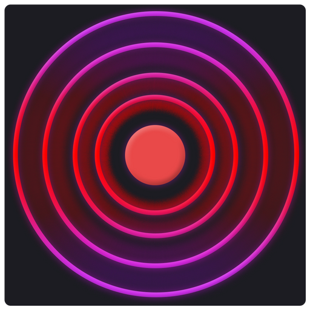

<!--
*** Thanks for checking out the Best-README-Template. If you have a suggestion
*** that would make this better, please fork the repo and create a pull request
*** or simply open an issue with the tag "enhancement".
*** Don't forget to give the project a star!
*** Thanks again! Now go create something AMAZING! :D
-->

<!-- PROJECT SHIELDS -->
<!--
*** I'm using markdown "reference style" links for readability.
*** Reference links are enclosed in brackets [ ] instead of parentheses ( ).
*** See the bottom of this document for the declaration of the reference variables
*** for contributors-url, forks-url, etc. This is an optional, concise syntax you may use.
*** https://www.markdownguide.org/basic-syntax/#reference-style-links
-->

<!--
*** Thanks for checking out the Best-README-Template. If you have a suggestion
*** that would make this better, please fork the repo and create a pull request
*** or simply open an issue with the tag "enhancement".
*** Don't forget to give the project a star!
*** Thanks again! Now go create something AMAZING! :D
-->

<!-- PROJECT LOGO -->
 

  

<h3 align="center">ZeroDrop Rust</h3>

  

    Efficiently embed hidden messages straight into plaintext
     
  

<!-- TABLE OF CONTENTS -->

  
Table of Contents

  <ol>
    <li>
      <a href="#about-the-project">About The Project</a>
      <ul>
        <li><a href="#built-with">Built With</a></li>
      </ul>
    </li>
    <li>
      <a href="#installation">Getting Started</a>
    </li>
    <li><a href="#usage">Usage</a></li>
    <li><a href="#license">License</a></li>
  </ol>

<!-- ABOUT THE PROJECT -->
## About ZeroDrop

ZeroDrop uses multiple zero-width invisible characters and arranges them to encode text and hide them in seemingly normal messages. Passwords can be used to generate unique character sets to prevent others from viewing the message.

This is a remake of my [original Python project](https://www.github.com/Cyclip/zerodrop) which did the same thing but very inefficiently and unaesthetically.

This is just a fun little project and is not amazingly secure; with some effort the text could be decoded. It is best if only the parties exchanging hidden messages are aware of the program.

**ZeroDrop may not work for operating systems other than Windows.**

(<a href="#top">back to top</a>)

### Built With

* [Rust](https://www.rust-lang.org/)
* [Tauri Studio](https://tauri.studio/)
* [React.js](https://reactjs.org/)
* [Font-Awesome](https://fontawesome.com/start)
* [Awesome-Notifications](https://f3oall.github.io/awesome-notifications/)

(<a href="#top">back to top</a>)

<!-- GETTING STARTED -->
## Installation

Download the latest release of ZeroDrop on the [releases page](https://www.github.com/Cyclip/zerodrop_rust/releases).

<!-- USAGE EXAMPLES -->
## Usage

1. Navigate to the passwords tab and enter a password in
   * Must be 4-32 chars and alphanumeric
   * To decode the hidden message, you will need this same password.
2. Navigate to embed and enter a plaintext message.
   * This will be what anyone sees
3. Enter the hidden message in the textbox below
4. Press embed!

To extract,  
1. Navigate to the extract tab (assuming the correct pw is set)
2. Enter the hidden message
3. Press extract

(<a href="#top">back to top</a>)

<!-- LICENSE -->
## License

Distributed under the MIT License. See `LICENSE.txt` for more information.

(<a href="#top">back to top</a>)

<!-- MARKDOWN LINKS & IMAGES -->
<!-- https://www.markdownguide.org/basic-syntax/#reference-style-links -->
[contributors-shield]: https://img.shields.io/github/contributors/github_username/repo_name.svg?style=for-the-badge
[contributors-url]: https://github.com/github_username/repo_name/graphs/contributors
[forks-shield]: https://img.shields.io/github/forks/github_username/repo_name.svg?style=for-the-badge
[forks-url]: https://github.com/github_username/repo_name/network/members
[stars-shield]: https://img.shields.io/github/stars/github_username/repo_name.svg?style=for-the-badge
[stars-url]: https://github.com/github_username/repo_name/stargazers
[issues-shield]: https://img.shields.io/github/issues/github_username/repo_name.svg?style=for-the-badge
[issues-url]: https://github.com/github_username/repo_name/issues
[license-shield]: https://img.shields.io/github/license/github_username/repo_name.svg?style=for-the-badge
[license-url]: https://github.com/github_username/repo_name/blob/master/LICENSE.txt
[linkedin-shield]: https://img.shields.io/badge/-LinkedIn-black.svg?style=for-the-badge&logo=linkedin&colorB=555
[linkedin-url]: https://linkedin.com/in/linkedin_username
[product-screenshot]: images/screenshot.png